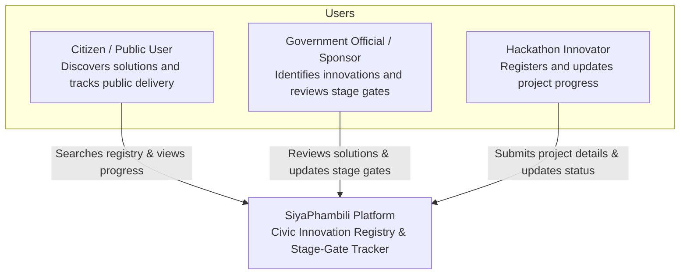
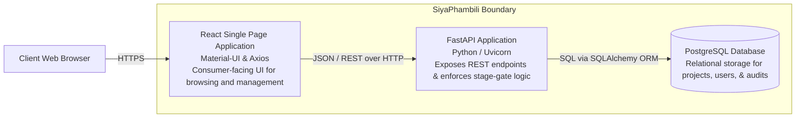
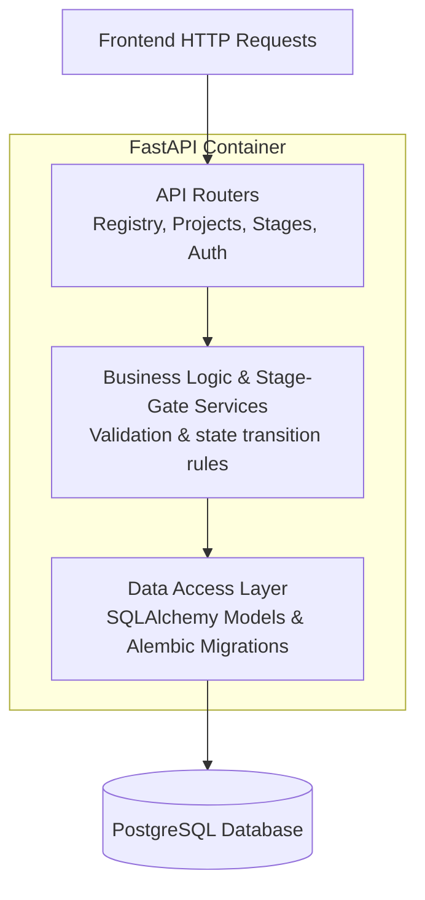

# SiyaPhambili — System Architecture (C4 Model)

This document outlines the visual software architecture for **SiyaPhambili** using the C4 Model approach (Context, Containers, Components). Diagrams are written using native Mermaid syntax and render directly on GitHub.

---

## Level 1: System Context Diagram

The System Context diagram illustrates how SiyaPhambili fits into the broader ecosystem, identifying the primary user roles and their interactions with the platform.

---

## Level 2: Container Diagram

The Container diagram zooms into the SiyaPhambili system boundary to display the high-level software containers, their responsibilities, and how they communicate over network protocols.

---

## Level 3: Component Diagram (FastAPI Backend)

The Component diagram breaks down the internal structure of the FastAPI backend application container into its modular parts.

---

## Architecture Summary

| Container | Technology | Responsibility |
| :--- | :--- | :--- |
| **Frontend** | React, Material-UI, Axios | Delivers an accessible, consumer-facing interface for registry browsing and tracking. |
| **Backend API** | Python, FastAPI | Serves REST endpoints, validates stage transitions, and powers automatic Swagger documentation. |
| **Database** | PostgreSQL | Persists relational data models for projects, sectors, and stage-gate progression. |
| **Container Engine** | Docker Compose | Standardizes the local PostgreSQL runtime environment across all developer machines. |