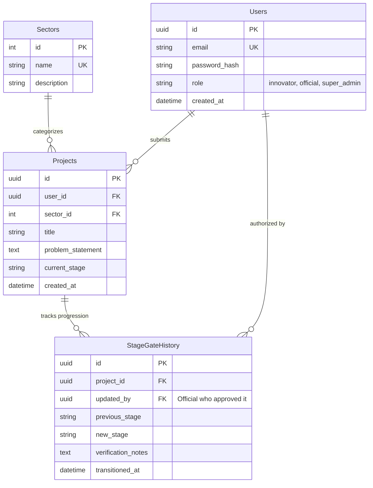

```mermaid
erDiagram
    Users {
        uuid id PK
        string email UK
        string password_hash
        string role "innovator, official, super_admin"
        datetime created_at
    }
  
    Sectors {
        int id PK
        string name UK
        string description
    }
  
    Projects {
        uuid id PK
        uuid user_id FK
        int sector_id FK
        string title
        text problem_statement
        string current_stage
        datetime created_at
    }
  
    StageGateHistory {
        uuid id PK
        uuid project_id FK
        uuid updated_by FK "Official who approved it"
        string previous_stage
        string new_stage
        text verification_notes
        datetime transitioned_at
    }

    %% Relationships reordered and flipped for a cleaner layout
    Sectors ||--o{ Projects : "categorizes"
    Users ||--o{ Projects : "submits"
    Projects ||--o{ StageGateHistory : "tracks progression"
    StageGateHistory }o--|| Users : "authorized by"
```
