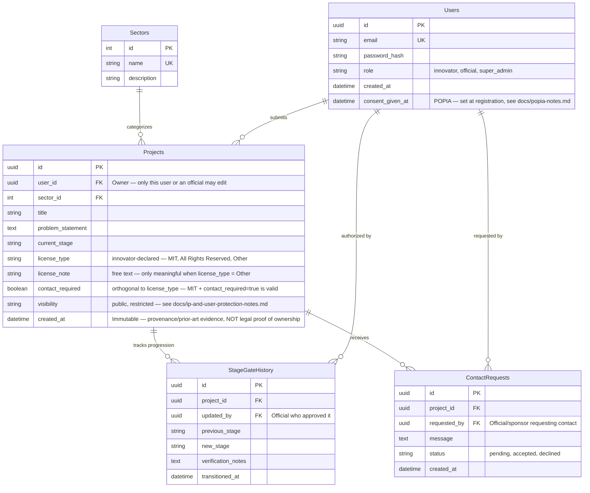

```mermaid
erDiagram
    Users {
        uuid id PK
        string email UK
        string password_hash
        string role "innovator, official, super_admin"
        datetime created_at
        datetime consent_given_at "POPIA — set at registration, see docs/popia-notes.md"
    }
  
    Sectors {
        int id PK
        string name UK
        string description
    }
  
    Projects {
        uuid id PK
        uuid user_id FK "Owner — only this user or an official may edit"
        int sector_id FK
        string title
        text problem_statement
        string current_stage
        string license_type "innovator-declared — MIT, All Rights Reserved, Other"
        string license_note "free text — only meaningful when license_type = Other"
        boolean contact_required "orthogonal to license_type — MIT + contact_required=true is valid"
        string visibility "public, restricted — see docs/ip-and-user-protection-notes.md"
        datetime created_at "Immutable — provenance/prior-art evidence, NOT legal proof of ownership"
    }

    ContactRequests {
        uuid id PK
        uuid project_id FK
        uuid requested_by FK "Official/sponsor requesting contact"
        text message
        string status "pending, accepted, declined"
        datetime created_at
    }

    StageGateHistory {
        uuid id PK
        uuid project_id FK
        uuid updated_by FK "Official who approved it"
        string previous_stage
        string new_stage
        text verification_notes
        datetime transitioned_at
    }

    %% Relationships reordered and flipped for a cleaner layout
    Sectors ||--o{ Projects : "categorizes"
    Users ||--o{ Projects : "submits"
    Projects ||--o{ StageGateHistory : "tracks progression"
    StageGateHistory }o--|| Users : "authorized by"
    Projects ||--o{ ContactRequests : "receives"
    ContactRequests }o--|| Users : "requested by"
```
